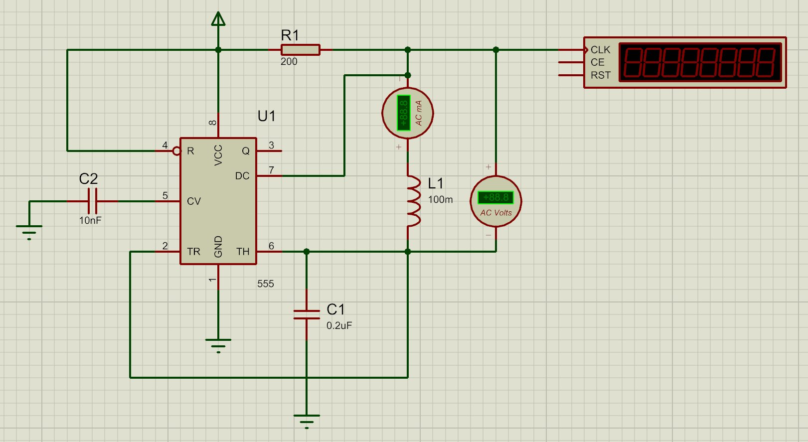

# Inductance Meter Using 555 Timer IC

> **Course:** EECE-314 — Electrical Measurement, Instrumentation and Sensors Lab  
> **Institution:** Military Institute of Science and Technology (MIST)  
> **Department:** Electrical, Electronic and Communication Engineering  
> **Group:** 01

---

## 📋 Table of Contents
- [Overview](#overview)
- [Team Members](#team-members)
- [Working Principle](#working-principle)
- [Circuit Components](#circuit-components)
- [Simulation](#simulation)
- [Results & Calculations](#results--calculations)
- [Observations](#observations)
- [Limitations](#limitations)
- [Project Structure](#project-structure)
- [References](#references)

---

## Overview

This project implements a low-cost, practical inductance meter using the ubiquitous **NE555 Timer IC** operating in **astable mode**. Instead of using a dedicated LCR meter, the circuit generates an AC signal of known frequency and measures the resulting voltage and current across an unknown inductor. From these values, the inductive reactance and ultimately the inductance are calculated.

The design is especially suited for students and hobbyists who want to understand the relationship between frequency and inductance through hands-on experimentation.

---

## Working Principle

The 555 timer is configured in **astable mode**, producing a continuous square wave. The unknown inductor is placed in series with the circuit. By measuring the AC voltage across the inductor and the current through it, inductive reactance is found using Ohm's Law for AC:

$$X_L = \frac{V}{I}$$

The inductance is then derived using:

$$L = \frac{X_L}{2\pi f}$$

Where:
- $X_L$ = Inductive reactance (Ω)  
- $V$ = AC voltage across the inductor (V)  
- $I$ = AC current through the inductor (A)  
- $f$ = Oscillation frequency from the 555 timer (Hz)

The **555 astable frequency** is set by:

$$f = \frac{1.44}{(R_1 + 2R_2) \cdot C}$$

---

## Circuit Components

| Component | Value | Purpose |
|---|---|---|
| U1 (NE555) | — | Astable oscillator / signal generator |
| R1 | 200 Ω | Timing resistor |
| C1 | 0.2 µF | Timing capacitor |
| C2 | 10 nF | Control voltage bypass |
| L1 | Unknown (DUT) | Inductor under test |
| AC Ammeter | — | Measures current through L1 |
| AC Voltmeter | — | Measures voltage across L1 |
| Counter | — | Displays oscillation frequency |

> The 555 output (Pin 3) drives the L-R series branch. The frequency counter connected to the CLK pin of the display module reads the real-time oscillation frequency.

---

## Simulation

The circuit was simulated in **Proteus Design Suite**.  
Simulation file: [`simulation/inductor meter.pdsprj`](simulation/)

**Simulation Screenshot:**



---

## Results & Calculations

### Test Case — 10 mH Inductor

| Parameter | Simulated Value |
|---|---|
| Frequency (f) | 5499 Hz |
| Voltage across L1 (V) | 3.57 V |
| Current through L1 (I) | 9.85 mA |

**Step 1 — Inductive Reactance:**

$$X_L = \frac{V}{I} = \frac{3.57}{9.85 \times 10^{-3}} = 362.44 \ \Omega$$

**Step 2 — Measured Inductance:**

$$L_m = \frac{X_L}{2\pi f} = \frac{362.44}{2\pi \times 5499} \approx 10.5 \ \text{mH}$$

**Step 3 — Percentage Error:**

$$\% \text{Error} = \frac{L_m - L}{L} \times 100\% = \frac{10.5 - 10}{10} \times 100\% = 5\%$$


---

## Observations

### ⚠️ Key Finding: Error Increases with Higher Inductance Values

Through repeated simulation and testing at different inductance values, an important trend was identified:

> **The higher the inductance value of the DUT (Device Under Test), the greater the percentage error in the measured result.**

**Why this happens:**

1. **Impedance Dominance** — At higher inductance values, $X_L = 2\pi fL$ becomes very large relative to the resistive elements in the circuit. This means the total circuit impedance is increasingly dominated by the inductor, making the current very small and harder to measure accurately.

2. **Voltmeter/Ammeter Loading** — Virtual instruments (and real ones) have finite input impedances. At very high $X_L$, even small loading errors from meters produce proportionally larger errors in the final calculation.

3. **Frequency Sensitivity** — For large L, even a small drift in the 555's output frequency causes a significant shift in $X_L$, which compounds the error in the final $L_m$ calculation. The 555 timer's frequency is sensitive to component tolerances (R and C), making it less reliable at the extremes.

4. **Waveform Distortion** — Higher inductance values filter the square wave more aggressively (the inductor acts as a low-pass filter), distorting the AC waveform seen by the voltmeter and reducing measurement reliability.

**Practical implication:** This meter is most accurate in the **low-to-mid inductance range** (roughly 1 mH – 50 mH with the given component values). For very high inductance values, recalibration or component changes (lower frequency, different R/C) are recommended.

---

## Limitations

- Accuracy depends on the precision of R and C components used in the 555 circuit.
- Parasitic capacitance and inductance in wiring can affect readings.
- The square wave from the 555 contains harmonics; the AC meters respond to the fundamental but harmonics introduce minor errors.
- Not suitable for measuring very small inductances (< 100 µH) without redesigning for a higher oscillation frequency.

---

## Project Structure

```
inductance-meter-555/
│
├── README.md                  ← You are here
│
├── simulation/
│   └── inductor meter.pdsprj  ← Proteus simulation file
│
├── schematics/
│   └── circuit_diagram.png    ← Circuit screenshot
│
├── docs/
│   └── Measurement_Report.pdf ← Full project report
│
└── results/
    └── observations.md        ← Detailed tabulated results
```

---

## References

1. Atwell, C. S. — *Essential 555 IC: Design, Configure, and Create Clever Circuits*
2. Mims III, F. M. — *Timer, Op Amp, and Optoelectronic Circuits & Projects*
3. Electronics Tutorials — 555 Oscillator Tutorial
4. Hyperspace Pirate (YouTube) — Inductor Tester
5. Texas Instruments — NE555 Datasheet
6. ElectronicsForum — 555 Timer IC Pinout, Circuit, Working
7. Electrical Engineering Stack Exchange — Choosing frequency for LCR measurement

---

*Military Institute of Science and Technology — EECE-314 Lab, 2024*
